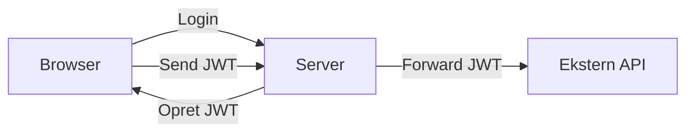

**Autorisation på serveren**
- Kun brugere med rollen `"Employee"` eller `"Admin"` får adgang til den side, som kalder API'en.
- **.NET Identity håndterer dette via sessioner/cookies** – ingen JWT nødvendig.
  
**Ekstern API får ikke brugerinfo**:
- Det eksterne API ser kun: "Det er Gotorz's server der ringer (via API-nøgle)".
- Det ved **intet** om den enkelte bruger – og behøver ikke at vide det.
  
---

### Hvorfor dette er sikkert?

|Lag|Hvem autentificeres?|Hvordan?|
|---|---|---|
|**Browser → Server**|Brugeren|.NET Identity (cookies/session)|
|**Server → API**|Din server|API-nøgle eller service account|
**Brugeren eksponeres aldrig for API'et** 
Han interagerer kun med vores server.

**API'et stoler kun på serveren** 
Det kræver ingen bruger-specifik viden.

Hvis vi **tvang** JWT ind i vores arkitektur

**Men API'et forventer en API-nøgle!** Den forstår ikke vores JWT.

**Serveren skal alligevel validere JWT’en** (ekstra kompleksitet).

Der er ingen gevinst. Vi får ikke mere sikkerhed eller funktionalitet.

---

### Hvornår vi ville mangle JWT?
Hvis det eksterne API krævede:

> _"Hver enkelt bruger skal autentificeres direkte over for os med deres egne credentials"

Det gør det i  HotelAPI'en.

**Så skulle vi:**
Sende et **JWT (for brugeren)** til API'et

Dette er IKKE vores situation i flightAPI'en. 
API’en accepterer vores API-nøgle fra serveren.

---

### Konklusion
**Brugerautorisation**
Håndteres af .NET Identity via `[Authorize]`
 
**API-adgang** 
Håndteres af serverens system-identitet (API-nøgle)

**Ingen JWT** 
Fordi den eksterne API **ikke skal kende brugerne**