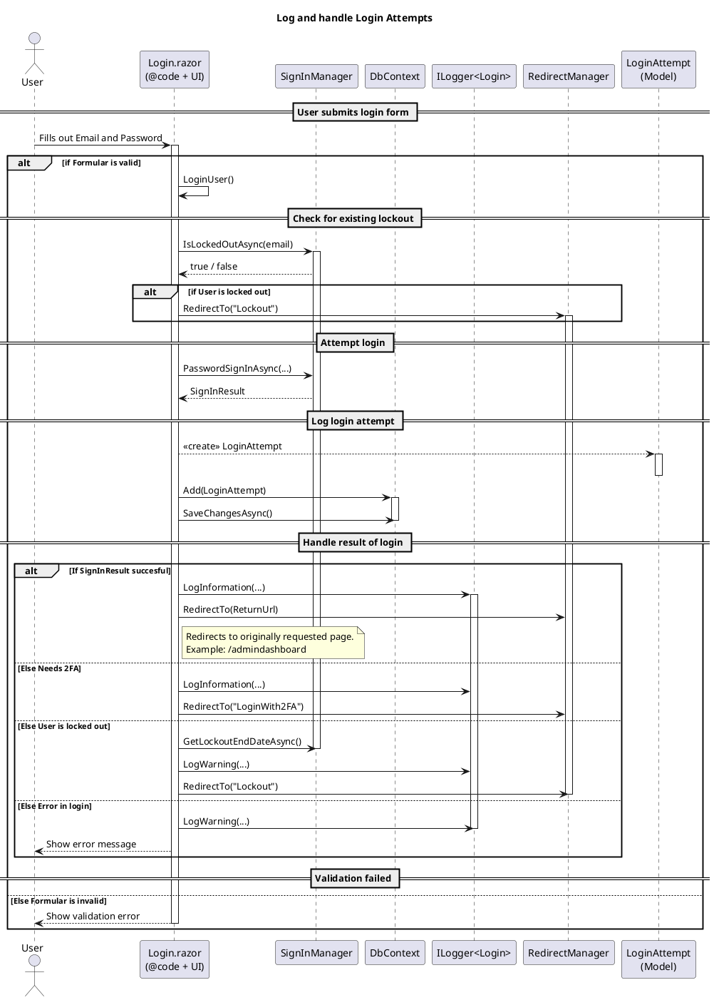
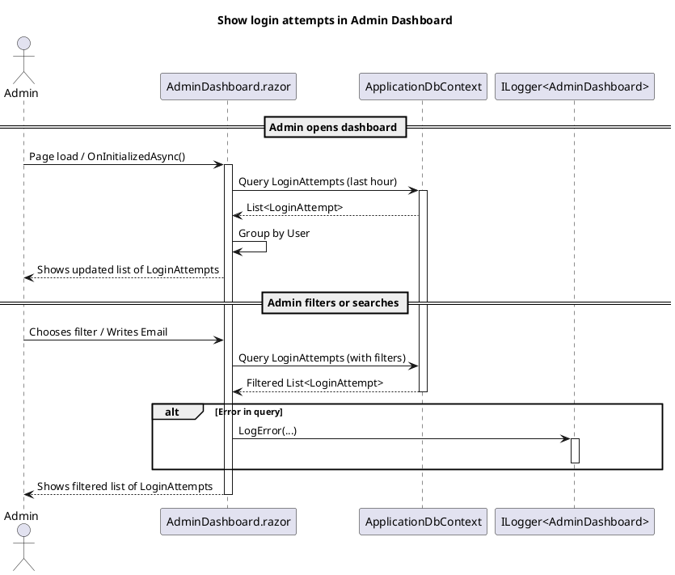

**Hvad er fordelene ved at logge IP-adresse ved loginforsøg?**

- Gør det muligt at opdage geografisk mistænkelige mønstre.
     
- Bruges til at blokere bestemte IP'er.
    
- Hjælper med retslig efterforskning eller support.
    

**Hvordan kunne systemet udvides til at sende advarsler ved gentagne fejlforsøg?**  
Man kunne:

- Tilføje e-mail/SMS-varslinger til administratorer.
    
- Bruger SignalR til realtidsnotifikationer.
    
- Integrere med f.eks. Discord eller Slack via webhook.
    

---

