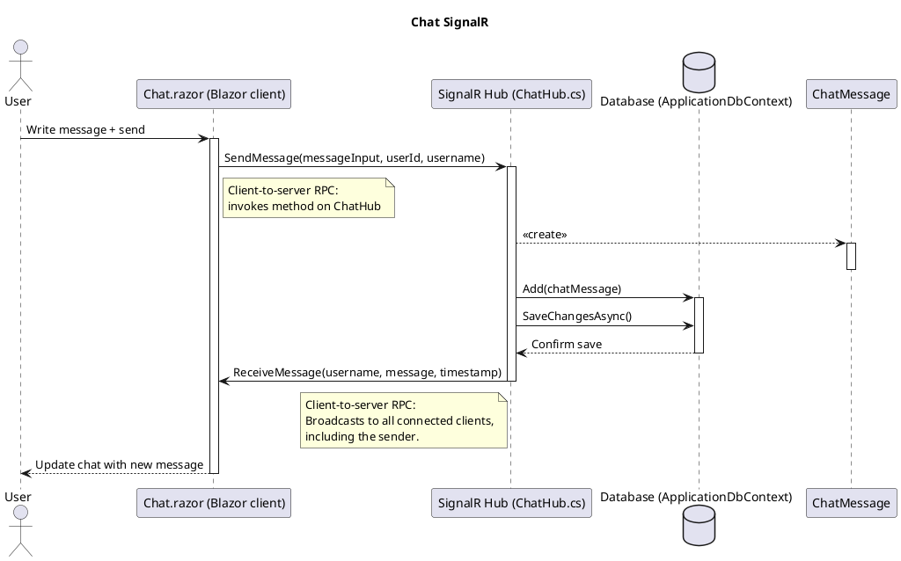

---

## SignalR og netværk
### Sådan passer SignalR ind i OSI-modellen:

**Applikationslaget (OSI lag 7)**  
Her lever SignalR som en del af selve applikationen. 
Det er dette lag, hvor protokoller som HTTP og WebSocket også hører til. 
SignalR gør det let at bruge WebSocket, men kan også falde tilbage til fx Server-Sent Events eller Long Polling, alt afhængig af, hvad klient og server understøtter.

**Præsentationslaget og sessionslaget (lag 6 og 5)**  
Disse lag håndteres som regel af frameworket (ASP.NET, browser osv.), og ikke direkte af SignalR. Kryptering (TLS) vil typisk ske her, men styres via HTTPS.

**Transportlaget (lag 4)**  
SignalR bruger [[TCP]] som transportprotokol. 
Når den bruger WebSockets, foregår det over TCP-port 80 (HTTP) eller 443 (HTTPS). 
TCP sikrer, at data leveres i korrekt rækkefølge og uden tab.

**Netværkslaget (lag 3)**  
Her bruges IP-adresser til at finde vej mellem klient og server over internettet eller et lokalt netværk. 
Det har SignalR ikke direkte indflydelse på, men det er nødvendigt for forbindelsen.

**Datalink og fysisk lag (lag 2 og 1)**  
Disse lag handler om netværkskort, switche, kabler osv., og ligger langt under det, SignalR arbejder med.

---

### Eksempel:
Forestil dig en webapp, hvor en bruger får besked i realtid, når en ny besked ankommer i en chat. SignalR holder en åben forbindelse (fx via WebSocket) mellem browser og server. 

Når en ny besked sendes, går den:

1. Gennem SignalR (Applikationslaget),
    
2. Via WebSocket over TCP (Transportlaget),
    
3. Over IP (Netværkslaget),
    
4. Og fysisk over netværket (Datalink og fysisk lag).

---

### Eksempel af firewall-blokering af websocket

Hvis WebSocket er blokeret:

- SignalR opdager, at forbindelsen ikke kan oprettes.
    
- Den prøver næste metode, fx Long Polling, hvor klienten hele tiden spørger serveren “har du noget nyt?”.
    
- Det virker stadig, men du får lidt mere latency og mere netværkstrafik.
    
---

**Hvorfor bruger SignalR TCP og ikke UDP?**  
Fordi SignalR kræver pålidelig kommunikation – chat og realtidsdata må ikke gå tabt.

**Hvordan sikrer man data, der sendes via SignalR?**  
Ved at bruge HTTPS, som krypterer trafikken – især vigtigt, hvis følsomme data sendes.

**Hvad sker der, hvis en man-in-the-middle angriber forsøger at opsnappe SignalR-trafikken?**  
Hvis HTTPS bruges, kan han ikke læse indholdet – men uden kryptering kan han aflytte alt.

**Hvordan påvirker fallback-mekanismer i SignalR brugeroplevelsen?**  
Mere latency og netværksbrug ved Long Polling. WebSocket er bedst, men kræver kompatibilitet.

---

## SignalR vs internt på server med events
### Fordele ved SignalR mellem klient og server
#### Separation of Concerns
**WASM-klienten** håndterer **UI-rendering og brugerinteraktion** lokalt (hurtigt, uden server-tur for hver handling).

**Serverprojektet** fungerer som en **dedikeret backend** til chatlogik (beskedrouting, persistence, osv.).

Dette gør systemet mere modulært, testbart og vedligeholdelsesvenligt.

#### Bedre ydeevne ved høj belastning
**Ren server**
**Alle brugerhændelser** deler den samme SignalR-forbindelse ("circuit"). 
- **Chattrafik kan overbelaste circuitet**, hvilket påvirker _hele_ appens responsivhed (f.eks. UI-opdateringer).
- Serveren skal håndtere flere simultane UI-opdateringer + chatbeskeder i én forbindelse.

**Client + server**
- Chattrafik kører over en **dedikeret SignalR-forbindelse** mellem WASM og server.

- Blazor Server-circuitten forbliver uforstyrret af chatbeskeder - Bedre overall ydeevne.

#### Optimeret ressourceforbrug på serveren
**Chat i Serverprojekt**
Blazor Server kræver **hukommelse per aktiv bruger** (da tilstand opbevares på serveren).
Hvis chatten implementeres i Blazor Server, øges serverens hukommelsesforbrug yderligere.
        
**Chat i WASM-klient**
- **Klienten håndterer UI-tilstand** (scroll-position, input-felter, etc.).

- Serveren har kun ansvar for at **transmittere beskeder** (mindre tilstand at holde styr på).