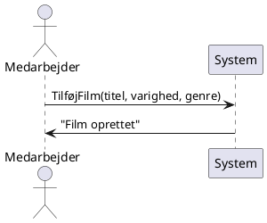
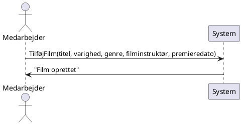
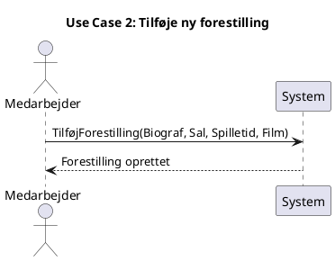

	
## Iteration 1
---
Baseret på [[Usecase#Use Case Tilføjelse af film|Usecase: Tilføjelse af film]]

## Iteration 2
---
### Baseret på [[Usecase#Use Case 1 Tilføj Film|Usecase: Tilføjelse af film (opdateret)]]

### Baseret på [[Usecase#Use Case 2 Tilføje ny forestilling|Usecase: TilFøje ny forestilling]]

