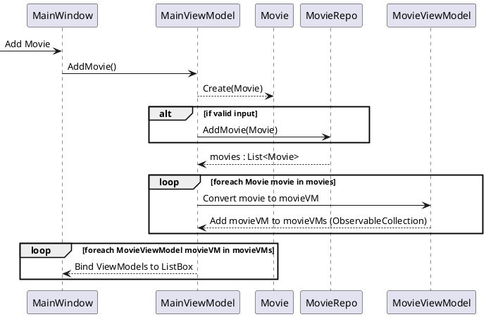
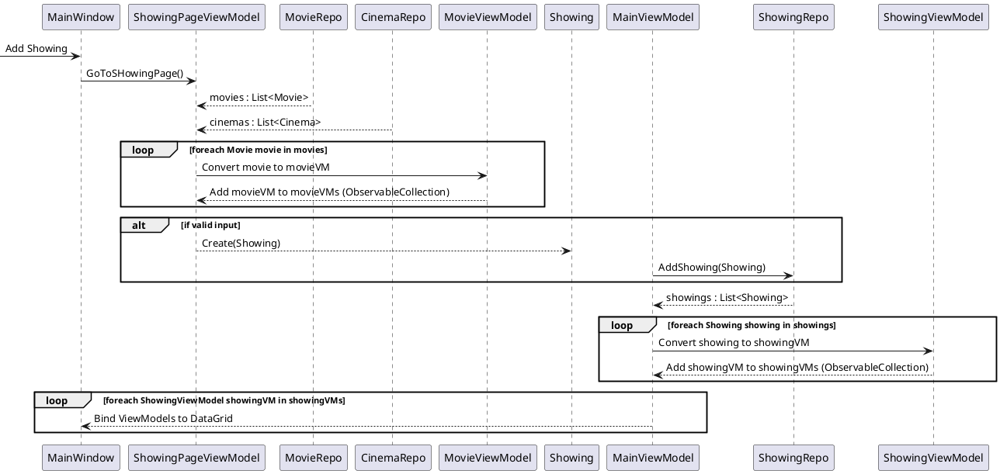

## Iteration 1
Baseret på [[Usecase#Use Case Tilføjelse af film|Usecase: Tilføjelse af film]]
DCD: [[DCD#Iteration 1|TheMovies DCD]]

---

## Iteration 2
Baseret på [[Usecase#Use Case 2 Tilføje ny forestilling|Usecase: Tilføj ny forestilling]]

