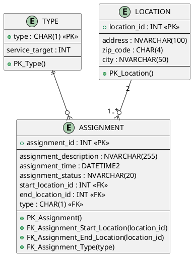

## Iteration 2
---

```plantuml
@startuml

entity ASSIGNMENT {
    + assignment_id : INT <<PK>>
    --
    assignment_description : NVARCHAR(255)
    assignment_time : DATETIME2
    assignment_status : NVARCHAR(20)
    start_location_id : INT <<FK>>
    end_location_id : INT <<FK>>
    type : CHAR(1) <<FK>>
    --
    + PK_Assignment()
    + FK_Assignment_Start_Location(location_id) 
    + FK_Assignment_End_Location(location_id)
    + FK_Assignment_Type(type)
}

entity TYPE {
    + type : CHAR(1) <<PK>>
    --
    service_target : INT
    --
    + PK_Type()
}

entity LOCATION {
    + location_id : INT <<PK>>
    --
    address : NVARCHAR(100)
    zip_code : CHAR(4)
    city : NVARCHAR(50)
    --
    + PK_Location()
}

LOCATION "2" --o{ "1..*" ASSIGNMENT : ""
TYPE ||--o{ ASSIGNMENT

@enduml
```
