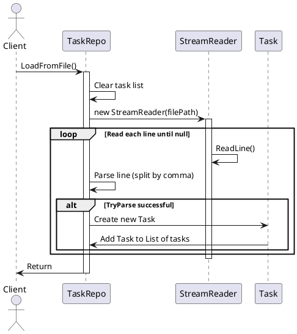
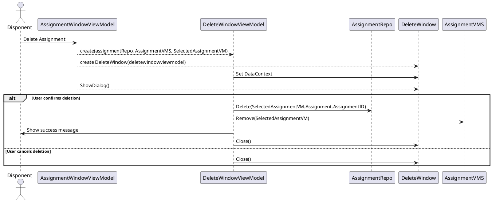
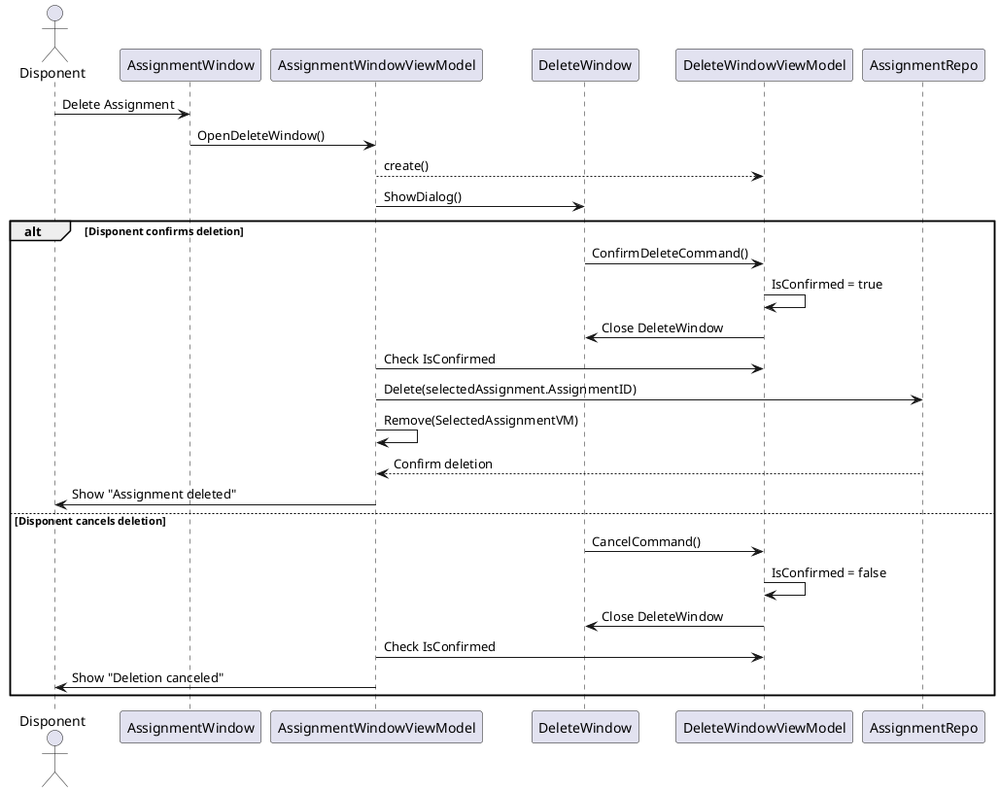

	## Iteration 1
---
#### Load From File

## Iteration 2
---
#### Delete Assignment

##### Alternativt Delete Assignment

Fordi ShowDialog() venter med at execute kode indtil det bliver lukket kan vi gøre sådan her.
Have et boolean flag i DeleteWindowViewModel. 
ConfirmDelete() sætter det til true.
Cancel() sæetter det til false.

I AssignmentWindowViewModel tjekker vi it et if statement om deleteWindowVM.IsConfirmed.
Hvis det er så kalder vi Delete() på repository og Remove på ObservableCollection (Alt dette i AssignmentWindowViewModel).

